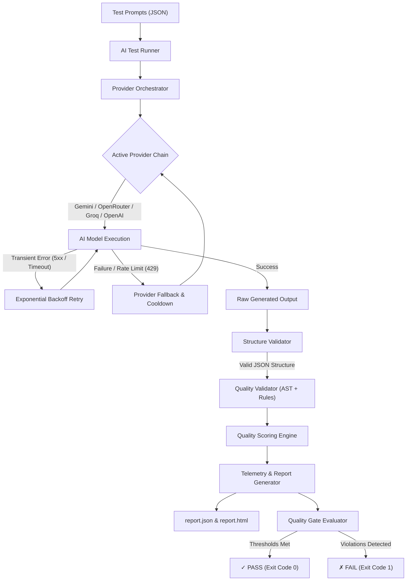
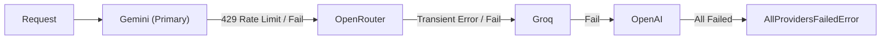

# Genix UI

**Genix UI** is an engineering-focused AI regression testing framework designed to validate, benchmark, and enforce deterministic quality standards on AI-generated frontend UI components.

## Why Genix UI?

AI models generate code non-deterministcally. A UI component generated by Gemini, OpenAI, or Claude may look visually acceptable while silently introducing critical defects: missing accessibility attributes (`aria-`, `role`, `tabIndex`), improper TypeScript types (using explicit `any`), forbidden inline styles (`style={{...}}`), anti-pattern CSS defaults, or incomplete component contracts.

Genix UI wraps multi-provider AI generation in a deterministic validation, scoring, and telemetry pipeline. It ensures that every generated UI artifact strictly satisfies accessibility, TypeScript, architecture, styling, and responsiveness constraints before passing CI/CD quality gates.

---

## ✨ Features

* **Multi-Provider AI Orchestration**: Orchestrates requests across Google Gemini, OpenRouter, Groq, OpenAI, and Anthropic Claude with dynamic priority routing.
* **Resilient Provider Fallback**: Automatically cascades to secondary providers when primary providers fail, experience rate limits, or encounter transient errors.
* **Exponential Backoff Retries**: Handles transient API timeouts and HTTP 5xx errors with configurable backoff delay and jitter.
* **Provider Cooldown & Disable Handling**: Automatically places rate-limited (HTTP 429) providers on temporary cooldown and disables misconfigured providers.
* **Deterministic Quality Validation**: Enforces exact rule checks across Accessibility, TypeScript, Component Architecture, Styling, and Responsiveness.
* **AST-Based Code Analysis**: Uses the TypeScript Compiler API (`ts.createSourceFile`) to inspect source code ASTs, catching forbidden explicit `any` types, JSX inline style attributes (`style={{...}}`), literal string `className` attributes, and `TODO` comments.
* **False-Positive Hardening**: Excludes code comments, README/documentation files, test files, storybook files, and file path strings from token validation to prevent adversarial bypasses.
* **Deterministic Quality Scoring**: Computes weighted percentage scores (0–100%) across quality categories with proportional deductions and deduplicated set accounting.
* **Negative & Mutation Testing**: Includes a 25-case mutation suite to prove the validator correctly rejects non-compliant code.
* **Adversarial & Security Testing**: Includes an 8-case security suite ensuring tokens inside comments, READMEs, file paths, or unrelated files cannot deceive the validator.
* **Performance Benchmarking & Reliability Suite**: Measures validator latency profiles (P50/P95/P99) and simulates complex provider fallback/retry state transitions.
* **Machine-Readable Telemetry & Reporting**: Generates structured `report.json` and interactive visual `report.html` dashboards with percentile latency, provider distribution, and root-cause failure breakdown.
* **Configurable Quality Gates**: Enforces build-gating threshold evaluation (pass rate, quality score, latency, fallback rate) that exits process with code `1` on failure.

---

## 4. Architecture



### Pipeline Execution Stages

1. **Prompt Ingestion**: Loads standardized prompt cases containing requirement tokens and expected component rule sets.
2. **Provider Orchestration**: Routes generation requests through an ordered provider priority chain with automated retries and fallbacks.
3. **Structure Validation**: Validates that raw response payloads strictly adhere to expected JSON schema structures and metadata requirements.
4. **AST & Quality Rule Validation**: Parses TypeScript ASTs and checks token constraints across accessibility, architecture, styling, typing, and responsiveness.
5. **Scoring Engine**: Calculates weighted category scores and an overall Quality Score percentage.
6. **Telemetry & Reporting**: Aggregates run latency, percentiles (P50/P95/P99), provider sequence records, and failure distributions into JSON and HTML reports.
7. **Quality Gate Evaluation**: Checks aggregated metrics against configured environment thresholds, returning exit code `0` on pass or `1` on failure.

---

## 5. Provider Orchestration

Genix UI supports multi-provider failover to guarantee generation reliability across model downtime or quota limits.



### Provider Behavior Matrix

* **Default Priority**: `gemini,openrouter,groq,openai` (configurable via `AI_PROVIDER_PRIORITY`).
* **Supported Providers**: `gemini`, `openrouter`, `groq`, `openai`, `claude`.
* **Retry Strategy**: Retries transient errors (HTTP 500, 502, 503, 504, network timeouts, rate limit 429) up to `maxRetries` (default: 3) using exponential backoff with random jitter.
* **Fallback Strategy**: Automatically switches to the next provider in the priority list after primary retries are exhausted or immediately on rate limits (429) / schema errors.
* **Cooldown Handling**: When a provider returns HTTP 429 (Rate Limit), it is marked as on cooldown (default: 60 seconds) and automatically skipped for subsequent requests in that window.
* **Permanent Disable**: Providers encountering HTTP 404 or unrecoverable configuration errors are added to `disabledProviders` for the session.
* **Authentication Failures**: HTTP 401/403 (`AuthenticationError`) immediately aborts the provider chain to prevent wasted quota.

---

## 6. Validation Pipeline

The Quality Validator evaluates generated files against predefined rulesets (`rule.registry.ts`) using a hardened multi-pass strategy.

### Quality Categories & Scoping

1. **Accessibility (`a11yTokens`)**: Mandates ARIA attributes (`aria-expanded`, `aria-controls`, `aria-label`, `aria-modal`), semantic roles (`role="button"`, `role="dialog"`), keyboard navigation (`tabIndex`, `onKeyDown`), and image alternate text (`alt=`).
2. **TypeScript & Typing (`tsTokens`)**: Checks interface definitions (`interface ButtonProps`), type annotations (`: string`, `: boolean`), and exported component signatures (`React.FC`). Enforces zero explicit `any` usage via TypeScript AST node parsing (`SyntaxKind.AnyKeyword`).
3. **Architecture (`archTokens`)**: Enforces clean named exports (`export const Button = ...`), modular file structures, and proper code-to-style separation.
4. **Styling (`styleTokens`)**: Requires CSS Module usage (`.module.css`). AST parsing flags forbidden JSX inline style attributes (`style={{...}}`) and hardcoded string `className` attributes.
5. **Responsiveness (`respTokens`)**: Checks for CSS `@media` queries in stylesheet files to ensure mobile responsiveness.

### Validator Hardening Measures

* **Main Component File Scoping**: Token compliance is evaluated specifically against primary component source files (`.tsx`/`.ts`), excluding `.test.tsx`, `.stories.tsx`, and `.md` files.
* **Documentation & Comment Stripping**: Comments (`/* ... */`, `// ...`) and documentation files (READMEs) are stripped before token evaluation, preventing false positives from code comments or documentation text.
* **Path & Token Pollution Protection**: Required tokens must appear in component code content, not file path strings.

---

## 7. Testing Strategy

Genix UI includes 6 distinct test suites to ensure framework integrity, scoring accuracy, and validator security:

| Test Suite | Purpose | Execution Command | Status / Pass Count |
|---|---|---|---|
| **Positive Regression Suite** | Validates compliant AI-generated UI components against real endpoints/prompts | `npm run test:ai` | ✅ 7 / 7 Passed |
| **Negative / Mutation Suite** | Confirms validator rejects components when mandatory requirements are missing | `npm run test:ai:negative` | ✅ 25 / 25 Passed |
| **Adversarial / Security Suite** | Ensures required tokens inside READMEs, comments, or file paths do not bypass checks | `npm run test:ai:negative` | ✅ 8 / 8 Passed |
| **Scoring Integrity Suite** | Verifies proportional scoring, category isolation, zero-applicable defaults, and score limits | `npm run test:ai:scoring` | ✅ 12 / 12 Passed |
| **Performance & Reliability Suite** | Measures validator execution speed and verifies mock-provider retry/fallback mechanics | `npm run test:ai:performance` | ✅ 13 / 13 Passed |
| **Quality Gate Suite** | Verifies environment variable threshold parsing, pass/fail evaluation, and boundary conditions | `npm run test:ai:gate` | ✅ 25 / 25 Passed |

---

## 8. Performance Numbers

Below are measured execution profiles from the deterministic validator benchmark suite (`npm run test:ai:performance`):

| Fixture Profile | Iterations | Total Time (ms) | Mean / Iter (ms) | Throughput (ops/sec) |
|---|---:|---:|---:|---:|
| **Button** | 100 | ~3.5 ms | ~0.035 ms | ~28,500 |
| **Card** | 100 | ~3.8 ms | ~0.038 ms | ~26,300 |
| **Navbar** | 100 | ~4.2 ms | ~0.042 ms | ~23,800 |
| **Modal** | 100 | ~4.0 ms | ~0.040 ms | ~25,000 |
| **Accordion** | 100 | ~3.9 ms | ~0.039 ms | ~25,600 |
| **Medium Fixture** | 100 | ~6.5 ms | ~0.065 ms | ~15,300 |
| **Large Fixture** | 100 | ~14.2 ms | ~0.142 ms | ~7,000 |
| **Multi-File Payload** | 100 | ~11.8 ms | ~0.118 ms | ~8,400 |

*Note: Benchmark snapshots reflect local execution on Node.js v22/v24 with `tsx`. Validator latency is sub-millisecond per component.*

---

## 9. Quality Gates

The Quality Gate system (`src/tests/ai/gates/`) evaluates total run telemetry against configurable environment thresholds.

### Configurable Environment Variables

| Variable | Type | Description | Default |
|---|---|---|---|
| `QUALITY_GATE_MIN_PASS_RATE` | `number` | Minimum acceptable overall pass rate percentage | `100` (%) |
| `QUALITY_GATE_MAX_FAILED_TESTS` | `number` | Maximum allowed failed test count | `0` |
| `QUALITY_GATE_MIN_AVG_QUALITY` | `number` | Minimum required average quality score percentage | `80` (%) |
| `QUALITY_GATE_MAX_P95_LATENCY_MS` | `number` | Maximum allowable P95 latency in ms (`0` = disabled) | `0` |
| `QUALITY_GATE_MAX_P99_LATENCY_MS` | `number` | Maximum allowable P99 latency in ms (`0` = disabled) | `0` |
| `QUALITY_GATE_MAX_FALLBACK_RATE` | `number` | Maximum allowed provider fallback rate percentage | `100` (%) |
| `QUALITY_GATE_MAX_RETRY_RATE` | `number` | Maximum allowed provider retry rate percentage | `100` (%) |

### CI/CD Quality Gate Enforcement Example

```bash
# Example strict CI configuration: minimum 90% pass rate, 85% average quality, max 50s P95 latency
export QUALITY_GATE_MIN_PASS_RATE=90
export QUALITY_GATE_MIN_AVG_QUALITY=85
export QUALITY_GATE_MAX_P95_LATENCY_MS=50000

npm run test:ai
# Exits with exit code 1 if any threshold is violated
```

---

## 10. Reports & Observability

Every execution of `npm run test:ai` outputs machine-readable telemetry and visual dashboards to `src/tests/ai/reports/`:

* **`report.json`**: Structured JSON report containing complete run metadata, configuration snapshots, test case results, individual provider attempt logs, latency percentiles (P50, P95, P99), provider distribution maps, and failure category breakdowns.
* **`report.html`**: Interactive single-file HTML dashboard featuring summary cards, status badges, percentile latency metrics, serving provider distribution charts, and filterable test case details with primary root-cause failure explanations.

---

## 11. Project Structure

```
server/
├── src/
│   ├── config/
│   │   └── ai.config.ts            # AI provider configuration & env defaults
│   ├── controllers/
│   │   └── ai.controller.ts        # Express endpoints for AI generation & conversion
│   ├── services/
│   │   └── ai/                     # Core AI service & provider implementations
│   │       ├── providers/          # Gemini, OpenRouter, Groq, OpenAI, Claude provider classes
│   │       └── parsers/            # Code & response parsing utilities
│   ├── utils/
│   │   └── ai/                     # Orchestration & metrics infrastructure
│   │       ├── provider.orchestrator.ts # Failover & priority chain orchestrator
│   │       ├── retry.strategy.ts        # Error classification & exponential backoff
│   │       ├── provider.metrics.ts     # In-memory attempt & windowed telemetry collector
│   │       └── ai.errors.ts            # Custom error hierarchy
│   └── tests/
│       └── ai/                     # AI Regression Testing Framework
│           ├── config/             # Test runner configuration (test.config.ts)
│           ├── gates/              # Quality gate evaluator & unit tests (quality.gate.ts, runner.ts)
│           ├── negative/           # Negative mutation & security test suite
│           ├── performance/        # Benchmark profiles & mock reliability scenarios
│           ├── prompts/            # JSON test case definitions (Accordion, Button, Card, etc.)
│           ├── reports/            # JSON & HTML report generators and report output files
│           ├── rules/              # Requirement rule registry (rule.registry.ts)
│           ├── runner/             # Test execution engine (test.runner.ts, index.ts)
│           ├── scoring/            # Scoring integrity test suite
│           ├── types/              # Framework interface definitions (test.types.ts)
│           └── validators/         # Structural & AST-hardened quality validator (output.validator.ts)
├── package.json
└── tsconfig.json
```

---

## 12. Getting Started

### Prerequisites

* Node.js v18+ or v20+
* npm or pnpm
* Running backend server instance (for live regression tests) or environment credentials for AI providers

### Setup Instructions

1. **Clone the repository**:
   ```bash
   git clone https://github.com/Sakshi-Chaturvedi/Genix-UI.git
   cd Genix-UI/server
   ```

2. **Install dependencies**:
   ```bash
   npm install
   ```

3. **Configure environment variables**:
   ```bash
   cp .env.example .env
   ```
   Add your provider API keys (e.g. `GEMINI_API_KEY`, `OPENROUTER_API_KEY`) to `.env`.

4. **Start the server** (in terminal 1):
   ```bash
   npm run dev
   ```

5. **Run the AI Regression Test Suite** (in terminal 2):
   ```bash
   npm run test:ai
   ```

---

## 13. Environment Variables

| Variable | Required | Description | Default |
|---|---|---|---|
| `PORT` | Optional | Backend server port | `5000` |
| `AI_DEFAULT_PROVIDER` | Optional | Default primary AI provider | `gemini` |
| `AI_PROVIDER_PRIORITY` | Optional | Provider fallback priority sequence | `gemini,openrouter,groq,openai` |
| `AI_TIMEOUT_MS` | Optional | AI provider HTTP request timeout (ms) | `45000` |
| `AI_MAX_RETRIES` | Optional | Max retry attempts per provider | `3` |
| `GEMINI_API_KEY` | Optional* | Google Gemini API Key | - |
| `GEMINI_MODEL` | Optional | Gemini model identifier | `gemini-2.5-flash` |
| `OPENROUTER_API_KEY` | Optional* | OpenRouter API Key | - |
| `OPENROUTER_MODEL` | Optional | OpenRouter model identifier | `meta-llama/llama-3.1-70b-instruct` |
| `GROQ_API_KEY` | Optional* | Groq API Key | - |
| `GROQ_MODEL` | Optional | Groq model identifier | `llama-3.1-8b-instant` |
| `OPENAI_API_KEY` | Optional* | OpenAI API Key | - |
| `OPENAI_MODEL` | Optional | OpenAI model identifier | `gpt-4o` |
| `CLAUDE_API_KEY` | Optional* | Anthropic Claude API Key | - |
| `CLAUDE_MODEL` | Optional | Claude model identifier | `claude-3-5-sonnet` |
| `TEST_API_BASE_URL` | Optional | Regression test target URL | `http://localhost:5000` |
| `QUALITY_GATE_MIN_PASS_RATE` | Optional | Quality Gate minimum pass rate % | `100` |
| `QUALITY_GATE_MIN_AVG_QUALITY` | Optional | Quality Gate minimum average quality score % | `80` |

*\* At least one valid provider API key is required to run live regression tests against AI models.*

---

## 14. Available Commands

The following npm scripts are defined in `server/package.json`:

```bash
# Run backend development server with hot-reload
npm run dev

# Build TypeScript output to dist/
npm run build

# Run primary AI regression test suite (executes prompts & quality gate)
npm run test:ai

# Run negative mutation & adversarial security test suite
npm run test:ai:negative

# Run scoring integrity test suite
npm run test:ai:scoring

# Run performance benchmark profiles & reliability orchestration suite
npm run test:ai:performance

# Run Quality Gate unit test suite
npm run test:ai:gate
```

---

## 15. CI/CD

> **Note**: CI/CD pipeline configuration (e.g. GitHub Actions workflows) is planned for upcoming milestones. The current Quality Gate evaluator and machine-readable `report.json` telemetry are fully implemented to support headless automated CI/CD gating and exit-code status checks.

---

## 16. Contributing

Contributions are welcome! Follow these steps to contribute:

1. **Fork the repository** and create a feature branch (`git checkout -b feature/new-component-rule`).
2. **Add or update test cases**:
   - To add a new UI component test case: add a JSON prompt file in `src/tests/ai/prompts/` and register rules in `src/tests/ai/rules/rule.registry.ts`.
   - To update validation rules: update `output.validator.ts` without weakening existing security or quality constraints.
3. **Execute all test suites**:
   ```bash
   npm run test:ai:gate
   npm run test:ai:scoring
   npm run test:ai:negative
   npm run test:ai:performance
   ```
4. **Open a Pull Request** with a detailed explanation of changes.

---

## 17. Development Principles

* **Deterministic Validation**: Never rely on non-deterministic LLM-as-a-judge for baseline compliance.
* **Fail Loudly & Surface Root Causes**: Expose exact error messages, missing tokens, and category failure tags.
* **Test the Validator**: Thoroughly test the validator itself using negative, adversarial, and scoring mutation suites.
* **Isolate Provider Failures**: Ensure transient API failures or rate limits do not break pipeline execution.
* **Zero Secret Exposure**: Never commit API keys or credentials; use `.env` configuration.

---

## 18. Roadmap

- [x] Multi-provider AI orchestration & failover
- [x] AST-based deterministic quality validation & scoring
- [x] Negative mutation & adversarial security test suites
- [x] Validator performance benchmarks & reliability test layer
- [x] Telemetry, P50/P95/P99 metrics & HTML dashboard generation
- [x] Configurable Quality Gate layer with non-zero exit codes
- [ ] GitHub Actions CI/CD pipeline integration
- [ ] Historical trend tracking & persistence database for latency/quality scores
- [ ] Visual regression snapshot testing for rendered UI components

---

## 19. Known Limitations

* **Live API Dependency**: Positive regression tests (`npm run test:ai`) require an active server instance and live provider API quotas.
* **Local Benchmark Variance**: Latency profile numbers measured in performance tests depend on host hardware and CPU load.
* **Substring Token Matching**: Token-based rules in `mustContain` rely on string matching within stripped component content; highly complex semantic conditions require AST rule extensions.

---

## 20. License

Licensing details need to be finalized prior to public distribution. See repository root for updates.
